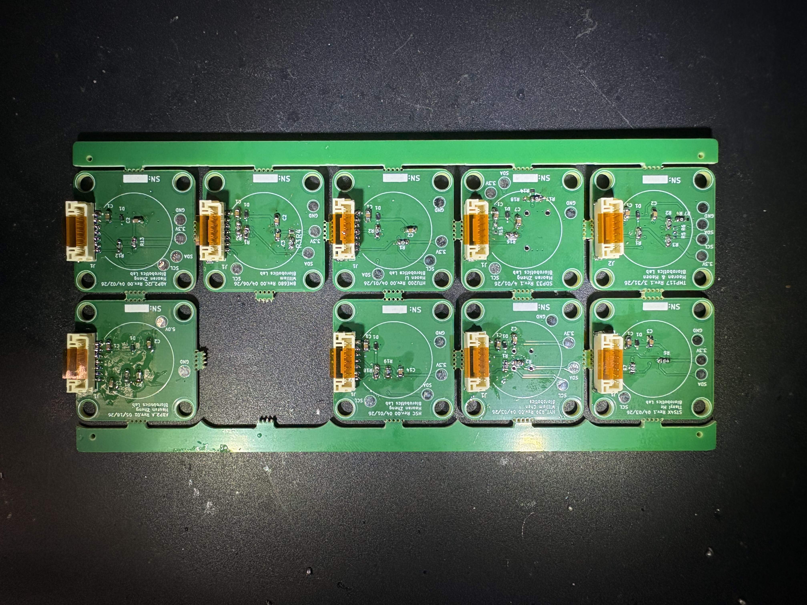
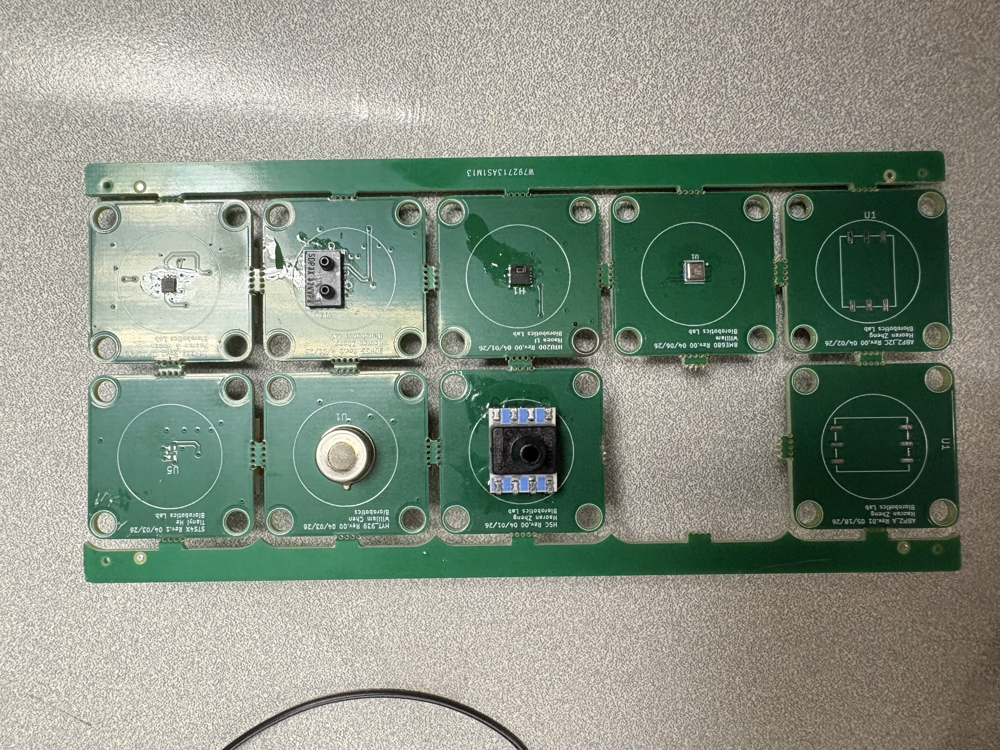
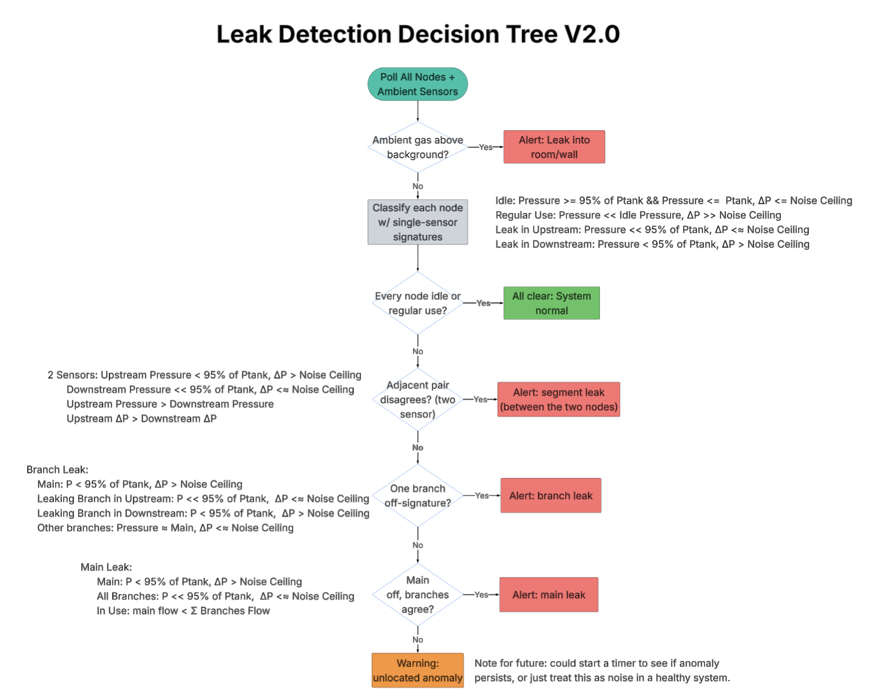
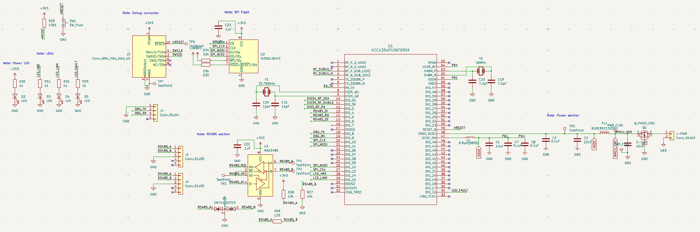
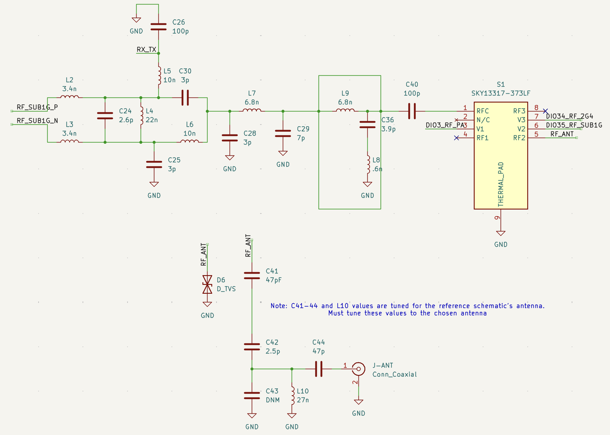

# MGPS Digitalization: Summer 2026 Research

**Medical Gas Pipeline System monitoring: embedded firmware, wireless networking, and PCB design.**

|              |                                                    |
| ------------ | -------------------------------------------------- |
| Researcher   | Joshua Kim                                         |
| Lab          | Biorobotics Lab, Carnegie Mellon University        |
| Advisor      | Lu Li                                              |
| Program      | SURA (Summer Undergraduate Research)               |
| Term         | Summer 2026                                        |

## Overview

Over Summer 2026 I contributed to the digitalization of Medical Gas Pipeline Systems (MGPS): the piped oxygen, nitrous oxide, medical air, and vacuum lines that hospitals depend on. My work spanned the sensing platform end to end: hardware bring-up and debugging, wireless microcontroller and protocol selection, sensor-node firmware, network architecture, antenna and sensor selection, PCB schematic design, and a leak-detection algorithm.

This document summarizes those contributions and links to the detailed research write-ups produced along the way.

## Summary of contributions

- Reviewed, assembled, and debugged **S-Board** sensor PCBs
- Selected the **CC1354P10** as the project's wireless MCU and validated its Sensor Controller CPU for the application
- Researched **sub-GHz** local wireless protocols for the hospital pipeline environment
- Implemented and tested **Sensor Controller CPU firmware** for the S-Board
- Analyzed **wireless gateway architectures** (bus vs. daisy chain) and specified **RS-485 (MAX485)** communication
- Selected **antennas** for the I-Board across prototype and production
- Evaluated **ambient gas sensor** candidates to complement the inline sensors
- Designed and iterated a **leak-detection decision tree**
- Designed and iterated the **I-Board PCB schematic**

## Hardware bring-up and debugging

Reviewed the S-Board sensor PCBs and handled board assembly and debugging. This included hand-soldering and rework of surface-mount components, during which I became proficient with a hot-air rework station and soldering iron.




## Wireless microcontroller selection

Researched wireless MCU candidates for the platform and selected the **TI CC1354P10**. As part of the evaluation I studied the CC1354P10's dedicated **Sensor Controller CPU** to confirm it could handle the project's sensor-sampling requirements independently of the main core.

Document: [MGPS Microcontroller Selection Rationale](https://docs.google.com/document/d/1rsyzq0siAnw985Shd1DYxkFmSlwrTzX-SFdXBUUzJgM/edit?usp=sharing)

## Wireless communication protocol research

Compared candidate local wireless communication protocols for the platform, including an assessment of whether **sub-GHz** communication is well-suited to a hospital pipeline setting (range, structural penetration, and spectrum considerations).

Document: [MGPS Wireless Protocol Comparison](https://docs.google.com/document/d/1602-SYJr9lgmlMoP_uMjRUhNhwKoYRWjJVH8SnuyxC4/edit?usp=sharing)

## Firmware: Sensor Controller CPU

Implemented and tested Sensor Controller CPU functionality for the S-Board firmware, exercising the low-power sensor-sampling paths validated during MCU selection.

## Network and gateway architecture

Analyzed the benefits and drawbacks of several local wireless gateway architectures, including the tradeoffs between **bus** and **daisy-chain** topologies, and proposed alternative architectures. Specified the **MAX485** module for **RS-485** communication.

Document: [MGPS Wireless Gateway Architectures](https://docs.google.com/document/d/1UJ4JxS4wCRm10uFp5kRGzcwo_AXsKsIqMvPEpDLtjw0/edit?usp=sharing)

## Antenna selection (I-Board)

Researched antenna options for the I-Board across two stages:

- **Prototyping:** external whip antenna via a U.FL connector
- **Production:** PCB-integrated meandered monopole

## Ambient gas sensing

Investigated the feasibility and effectiveness of adding **ambient** gas sensors alongside the existing inline sensors, and compiled a comparison of candidate parts covering **oxygen, nitrous oxide, carbon dioxide, and VOCs/NOx**.

Document: [MGPS Ambient Sensor Summary](https://docs.google.com/document/d/1xhM9SQteKde3pB2Vqt5qKKd6lQR4ypKINZXZiHowo7s/edit?usp=sharing)

## Leak-detection decision tree

Designed and iterated a decision-tree architecture for leak detection across the sensing system.



## I-Board PCB schematic

Designed and iterated the schematic for the I-Board PCB in KiCad.




## Research documents

- [MGPS Microcontroller Selection Rationale](https://docs.google.com/document/d/1rsyzq0siAnw985Shd1DYxkFmSlwrTzX-SFdXBUUzJgM/edit?usp=sharing)
- [MGPS Wireless Protocol Comparison](https://docs.google.com/document/d/1602-SYJr9lgmlMoP_uMjRUhNhwKoYRWjJVH8SnuyxC4/edit?usp=sharing)
- [MGPS Wireless Gateway Architectures](https://docs.google.com/document/d/1UJ4JxS4wCRm10uFp5kRGzcwo_AXsKsIqMvPEpDLtjw0/edit?usp=sharing)
- [MGPS Ambient Sensor Summary](https://docs.google.com/document/d/1xhM9SQteKde3pB2Vqt5qKKd6lQR4ypKINZXZiHowo7s/edit?usp=sharing)

## Repository structure

```
mgps-summer-research/
├── README.md            This overview
├── assets/              Figures referenced above (add image files here)
└── docs/                Optional: local copies of the research write-ups
```
